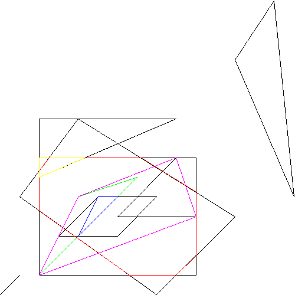

# Convex Polygons


##General documentation

This project consists of a Convex Polygon calculator (main.cc) and a set of classes, used by the calculator. You may also find a `Makefile` to compile the whole project. Moreover, a set of test examples is provided in order to check the functionality of the class.


##Installation instructions

The [pngwriter](https://github.com/pngwriter/pngwriter) library is needed to compile the project. It can be downloaded from

```bash
git clone https://github.com/pngwriter/pngwriter.git
```


##Compilation instructions

1. To compile the project it is only needed to type

   ```bash
   make
   ```

    on the Terminal (in the Convex_Polygon directory).

2. The pngwriter library is suposed to be, by default, in `$HOME/libs​`.

   This directories must be changed, if needed, in the `Makefile` to compile the project properly (change `CXXFLAGS` and `main.exe`).


##Polygon calculator

The main commands of this calculator are explained [here](https://github.com/jordi-petit/ap2-poligons-2019). However, some extra utilitites have been implemented:

### The `edges` command

The `edges` command prints the number of edges of the given polygon.

### The `regular` command

The `regular` command prints `yes` or  `not` to tell whether the given polygon is regular or not.

### The `getcol` command

The `getcol` command prints the color (in RGB format) of the given polygon.

### The `width` command

The `width` command prints the width of the given polygon (width of the bbox rectangle).

### The `height` command

The `height` command prints the height of the given polygon (height of the bbox rectangle).


### Errors

Because the calculator is limited to a finite number of commands, programmed in a very concrete format,  some errors may be displayed in the terminal. For instance, ``` "error: invalid command"```. 


## Some examples

There are some input examples to see how our calculator really works. After compiling the project, try to execute typing ```./main.exe<input2.txt``` . The expected output is:

```text
ok
a b box c d e p q r s 
error: undefined polygon identifier
11.500
4
yes
not
-2.500 -2.500
ok
f -1.000 1.286 -1.000 3.333 -0.500 4.000 4.200 4.000 7.000 2.250 7.000 -1.000 6.000 -2.000 3.600 -2.000
ok
#
ok
```

You will be able to produce nice pictures, such as this one (image.png):



Enjoy!


